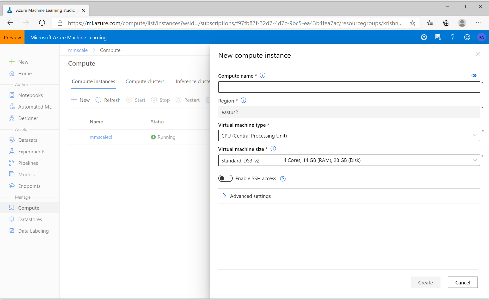
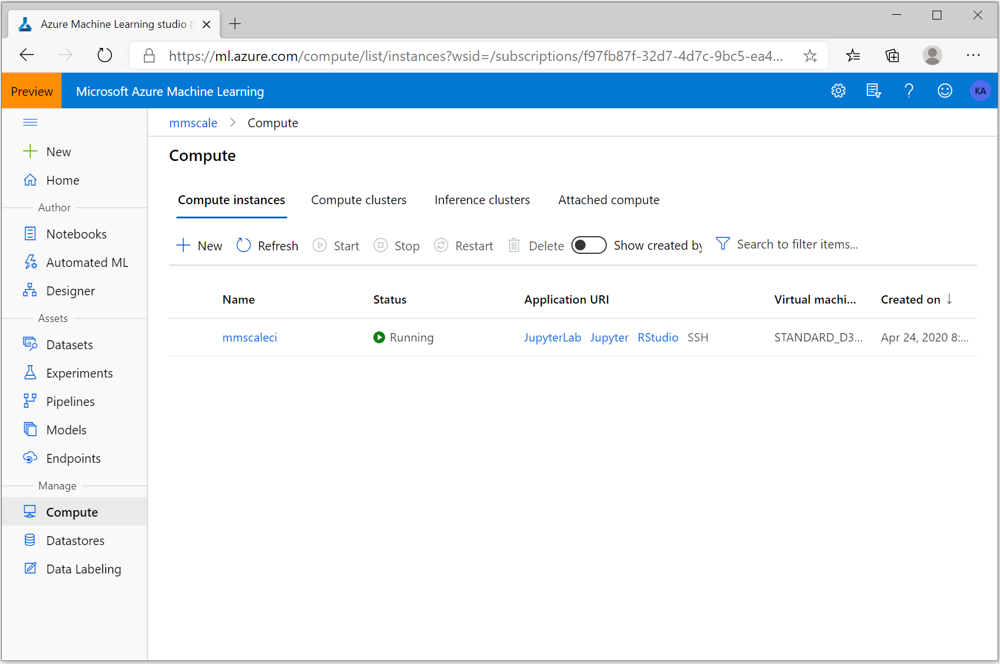

# KDD'20: From Zero to AI Hero with Automated Machine Learning 
### Presenters: 
Aniththa Umamahesan, Program Manager
Deepak Mukunthu Iyappan Babu,  Principal Program Manager
Cesar De la Torre Lorente, Principal Program Manager
Anup Shirgaonkar, Principal Data & Applied Scientist

The content below is a guide for a self-paced lab to understand the E2E Automated Machine Learning capabilities both through the Python code experience and UI no-code experience. 

While it's not required, a basic understanding of Azure Machine Learning will be helpful for understanding the solution. The following resources can help introduce you to AML:

1. [Azure Machine Learning Overview](https://azure.microsoft.com/services/machine-learning/)
2. [What is automated machine learning?](https://docs.microsoft.com/azure/machine-learning/concept-automated-ml)
3. [Automated ML Sample Notebooks on Github](https://github.com/Azure/MachineLearningNotebooks/tree/master/how-to-use-azureml/automated-machine-learning)

# Key Words
- Automated ML, Azure Machine Learning, Hyperparameter tuning, Python, JupyerLab, No-code UI

# Lab Agenda
1. [Prerequisites](#prereqs)
1. [Automated ML Introduction](#introduction)
1. [The studio Introduction](#studio)
1. [Lab Part 1. Train a regression model using the Automated ML UI](#automlUI)
1. [Setup a Compute Instance](#compute)
1. [Lab Part 2. Train a classification model using Automated ML in JupyertLab](#train)
1. [Next Steps](#complete)

<a name="prereqs"></a>
# Prerequisites
All you need is access to an [Azure subscription](https://azure.microsoft.com/free/) and an [Azure Machine Learning Workspace](https://docs.microsoft.com/azure/machine-learning/how-to-manage-workspace) that you'll create below.

### [Create a workspace](https://docs.microsoft.com/en-us/azure/machine-learning/tutorial-1st-experiment-sdk-setup#create-a-workspace)
An Azure Machine Learning workspace is a foundational resource in the cloud that you use to experiment, train, and deploy machine learning models. It ties your Azure subscription and resource group to an easily consumed object in the service.

You create a workspace via the Azure portal, a web-based console for managing your Azure resources.

1. Sign in to [Azure portal](https://portal.azure.com/) by using the credentials for your Azure subscription.

1. In the upper-left corner of Azure portal, select **+ Create a resource**.

    

1. Use the search bar to find **Machine Learning**.

1. Select **Machine Learning**.

1. In the **Machine Learning** pane, select **Create** to begin.

1. Provide the following information to configure your new workspace:

   Field|Description 
   ---|---
   Workspace name |Enter a unique name that identifies your workspace. In this example, we use **docs-ws**. Names must be unique across the resource group. Use a name that's easy to recall and to differentiate from workspaces created by others.  
   Subscription |Select the Azure subscription that you want to use.
   Resource group | Use an existing resource group in your subscription or enter a name to create a new resource group. A resource group holds related resources for an Azure solution. In this example, we use **docs-aml**. 
   Location | Select the location closest to your users and the data resources to create your workspace.
   Workspace edition | Select **Basic** as the workspace type for this tutorial. The workspace type (Basic & Enterprise) determines the features to which you’ll have access and pricing. Everything in this tutorial can be performed with either a Basic or Enterprise workspace.

1. After you are finished configuring the workspace, select **Review + Create**. 

   When the process is finished, a deployment success message appears. 
 
 1. To view the new workspace, select **Go to resource**.


<a name="introduction"></a>
# Automated ML introduction
Automated machine learning (automated ML) builds high quality machine learning models for you by automating model and hyperparameter selection. Bring a labelled dataset that you want to build a model for, automated ML will give you a high quality machine learning model that you can use for predictions.


If you are new to Data Science, automated ML will help you get jumpstarted by simplifying machine learning model building. It abstracts you from needing to perform model selection, hyperparameter selection and in one step creates a high quality trained model for you to use.

If you are an experienced data scientist, automated ML will help increase your productivity by intelligently performing the model and hyperparameter selection for your training and generates high quality models much quicker than manually specifying several combinations of the parameters and running training jobs. Automated ML provides visibility and access to all the training jobs and the performance characteristics of the models to help you further tune the pipeline if you desire.

<a name="studio"></a>
## The studio and automated ML authoring experience
Azure ML has a suite of authoring experiences in a user-interface format in [the studio](https://ml.azure.com). 

1. Visit [ml.azure.com](https://ml.azure.com)
2. Select your `directory`, `subscription`, and `workspace`

Automated ML is supported by three execution environments:
* Compute Instances
* Local Conda environment
* Azure Databricks 

<a name="automlUI"></a>
## Lab Part 1. Train a regression model using the Automated ML UI
In part 1 of the lab you will get to build an automated machine learning model using our UI. To get started head to [Lab 1](https://github.com/Aniththa/KDD-20-AutoML/blob/master/Lab%20Part%201%20-%20AutoML%20UI/Lab%20Part%201%20-%20AutoML%20UI.md) folder.

<a name="compute"></a>
## Using Compute Instances - Jupyter based notebooks from a Azure Virtual Machine
### 1.0 Creating an AzureML Compute Instance

To start with, we will create a Azure ML Compute Instance. The Compute Instance is an Azure VM and will serve as an interactive workstation in the cloud that serves as a Jupyter server.

1. Open [Azure Machine Learning Studio](https://ml.azure.com/).
2. Navigate to 'Compute Instances' tab in Compute and click on 'New'.
3. Choose some sufficiently unique name, keep the default VM type (STANDARD_DS3V2 -- a fairly inexpensive machine type costing about $0.27/hour) and click 'Create':


See [here](https://docs.microsoft.com/en-us/azure/machine-learning/concept-compute-instance) for details on creating AzureML Compute Instances.

**Note that this machine will keep running until you stop it from the portal.**

### 2.0 Clone git Repository to Workspace storage

To clone this git repository onto the workspace, follow the steps below:

1. To get started, first navigate to the JupyterLab instance running on the Compute Instance by clicking on the JupyterLab link shown below:


1. After going through authentication, you will see the JupyterLab frontend. As you authenticate, make sure to use the same user to log in as was used to create the Compute Instance, or else your access will be denied. Next open an Terminal (either by File/New/Terminal, or by just clicking on Terminal in the Launcher Window).


1. In the terminal window clone this repository by typing:
```
       git clone https://github.com/Aniththa/KDD-20-AutoML.git
```
4. You will be prompted to provide your github username and for your password you will need to provide a personal access token. Please follow the steps here to [create a personal access token.](https://help.github.com/en/github/authenticating-to-github/creating-a-personal-access-token-for-the-command-line) 

<a name="train"></a>
## Lab Part 2. Train a classification model using Automated ML in JupyertLab
In this part of the lab we will be covering how you can train a classification model in a code first experience with AutoML. To get started open **Lab Part 2 - AutoML Python SDK.ipynb** from the  Lab 2 folder in jupyter lab.

